# Detección de equipos, puertos, servicios y vulnerabilidades

## Indice

> * [WHOIS, DomainTools y DNSrecon](#whois-domaintools-y-dnsrecon)
> * [Nmap con scripts y Nikto](#nmap-con-scripts-y-nikto)
> * [Wfuzz y Dirb](#wfuzz-y-dirb)
> * [Searchsploit](#searchsploit)

En esta práctica vamos a obtener información  sobre las máquinas del laboratorio de vulnerabilidades (***DVWA, bWAPP, Multillidae II***).

## WHOIS, DomainTools y DNSrecon

**WHOIS** es una herramienta que no ofrece información sobre una ip o dominio, como dominio registrado, fecha de creación y de actualización del dominio, información sobre servidores, etc:

Se puede utilizar mediante comandos o mediante web:

**DomainTools** es otra herramienta que ofrece información sobre ips o dominios como sus servidores localizacion de estos, ips asociadas, etc:

**DNSrecon** permite obtener información sobre los registros DNS, también permite hacer ***reverse lookup*** (Obtener dominio mediente una ip):

## Nmap con scripts y Nikto

Antes de hacer escaneo de puertos con **Nmap** y **Nikto** podemos comprobar los propios puertos que se encuentra abiertos en mi equipo, si revisamos el **docker-compose.yml** que utilizamos para levantar máquinas vulnerables:

El 8000, 8001, 81, 82 y 389:

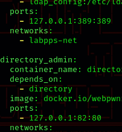

Ahora vamos a realizar un escaneo con nmap, ademas de los puertos abiertos, también nos aparecen los servicios asociados y sus versiones, algunos de los puertos que aparecen son de otros servicios diferentes a los de las máquinas vulnerables:

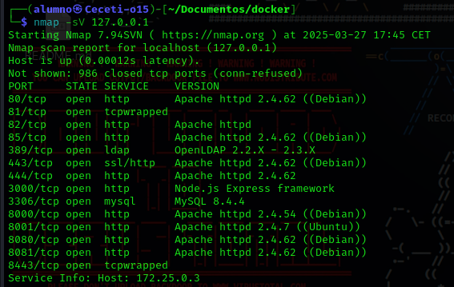

Vamos a realizar una escaneo con la herramienta **Nikto** 

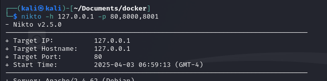

Obtenemos mucha información, como directorios que deberian estar ocultos pero están públicos:

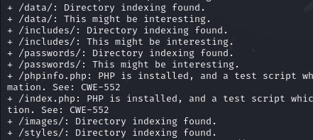

Secciones de las páginas que son vulnerables a **Inclusión remota de fichero**:

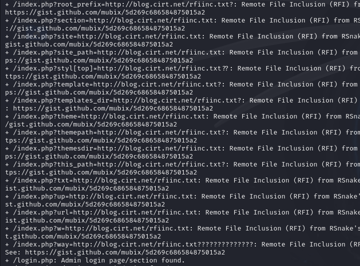

O ***Backdoors***:

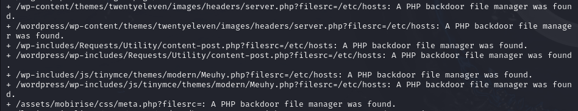

Con *nmap* también podemos hacer una búsqueda de las vulnerabilidades que puedan tener las máquinas:

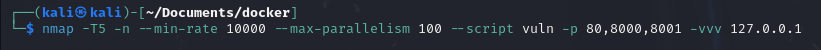

Nos aparecen posibles vulnerabilidades en *Multillidae II*, como posibles archivos con información sensible o de administrador:

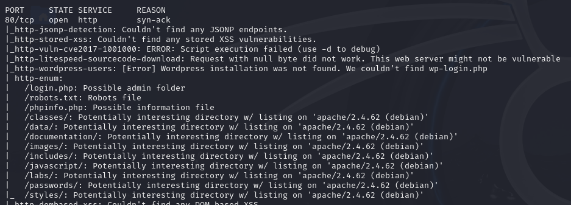

Y en *DVWA*, como posibles directorios de administrador públicos o el archivo *robots.txt*:

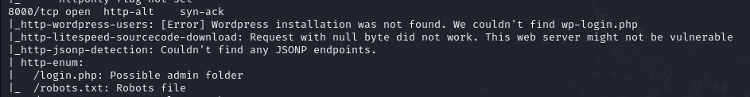

## Wfuzz y Dirb

Vamos a utilizar **wfuzz* para encontrar directorios en los diferentes servicios:

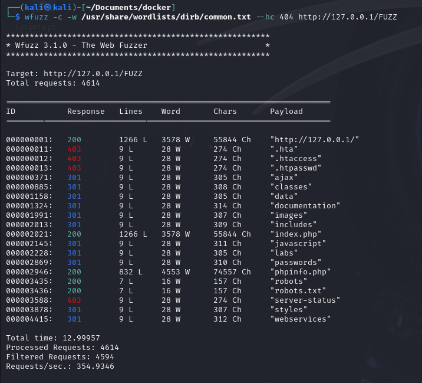

Encontamos varios como '*data*', '*images*' o '*passwords*' entre otros.

La información que obtenemos con la herramienta **dirb** es parecida a la extraida con **Wfuzz**:

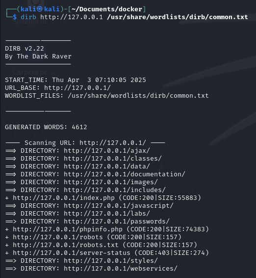

## Searchsploit

Con **Searchsploit** podemos realizar búsquedas de exploits, para realizar la explotación de vlnerabilidades:

Podemos buscar por código **CVE** en concreto:

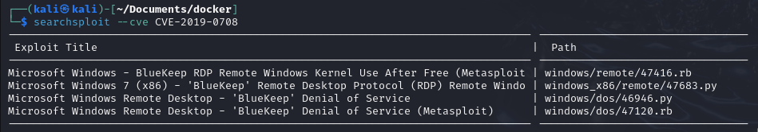

O también podemos buscar exploits por la versión del kernel o de sudo entre otros:

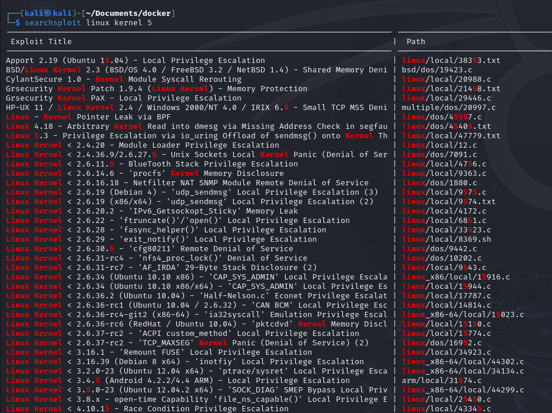
