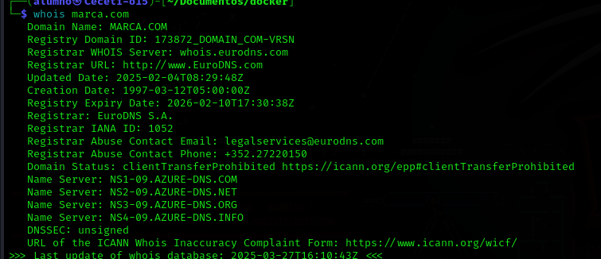
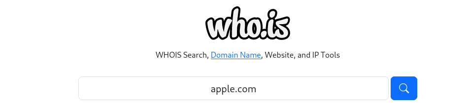
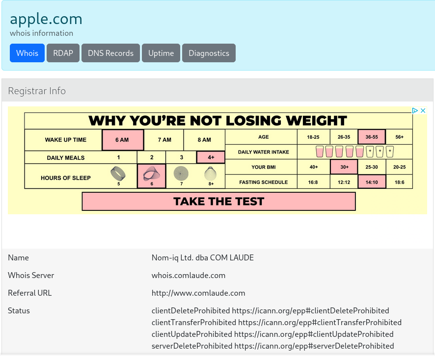
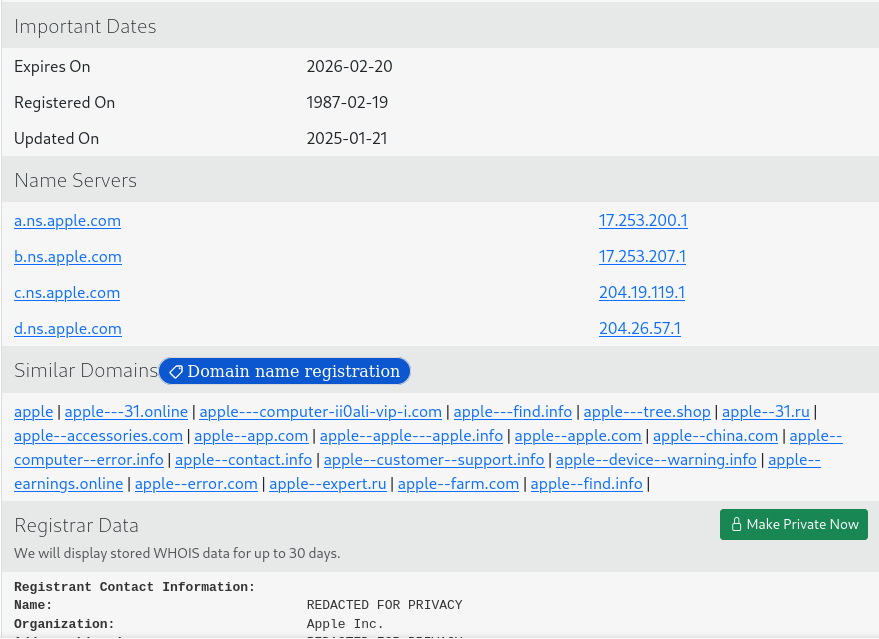
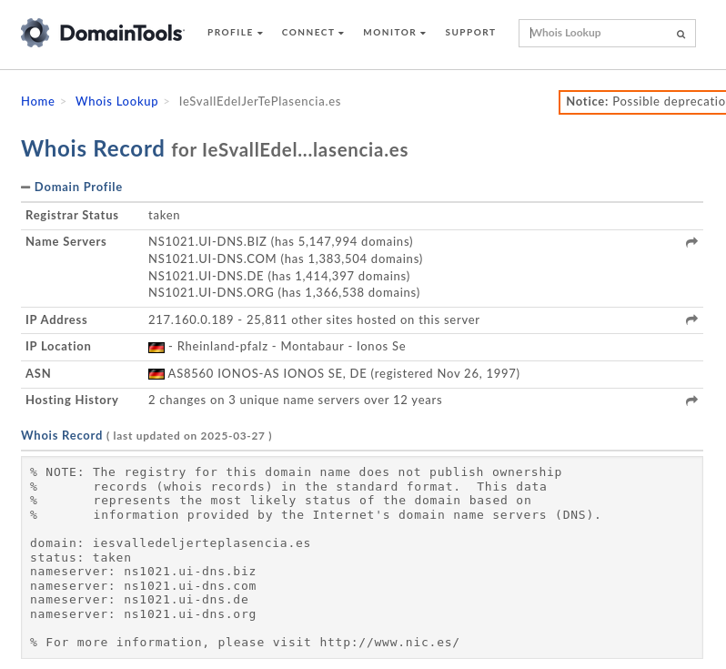
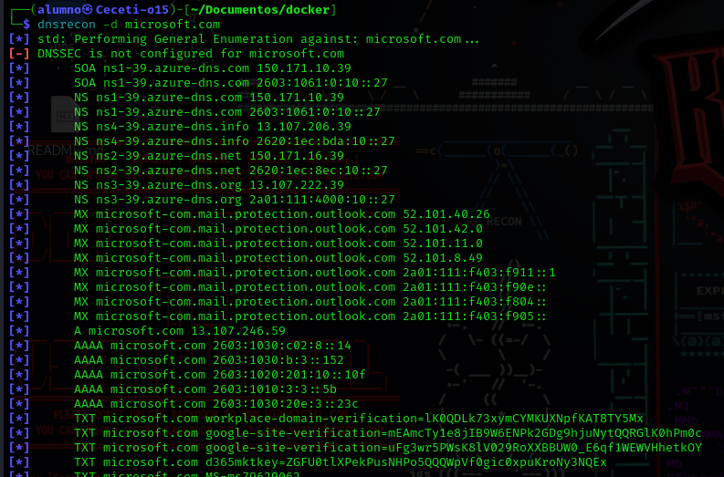
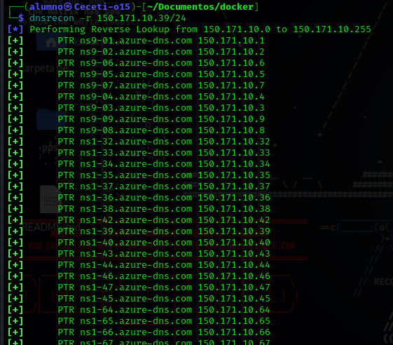
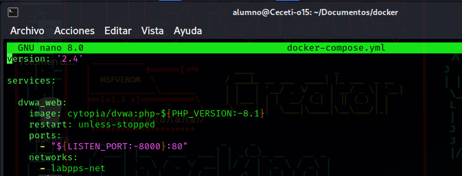
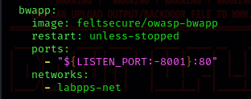
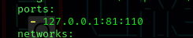

# Detección de equipos, puertos, servicios y vulnerabilidades

## Indice

> * [WHOIS, DomainTools y DNSrecon](#whois-domaintools-y-dnsrecon)
> * [Nmap con scripts y Nikto](#nmap-con-scripts-y-nikto)
> * [Wfuzz y Dirb](#wfuzz-y-dirb)
> * [Searchsploit](#searchsploit)

En esta práctica vamos a obtener información  sobre las máquinas del laboratorio de vulnerabilidades (***DVWA, bWAPP, Multillidae II***).

## WHOIS, DomainTools y DNSrecon

**WHOIS** es una herramienta que no ofrece información sobre una ip o dominio, como dominio registrado, fecha de creación y de actualización del dominio, información sobre servidores, etc:

Se puede utilizar mediante comandos o mediante web:

**DomainTools** es otra herramienta que ofrece información sobre ips o dominios como sus servidores localizacion de estos, ips asociadas, etc:

**DNSrecon** permite obtener información sobre los registros DNS, también permite hacer ***reverse lookup*** (Obtener dominio mediente una ip):

## Nmap con scripts y Nikto

Antes de hacer escaneo de puertos con **Nmap** y **Nikto** podemos comprobar los propios puertos que se encuentra abiertos en mi equipo, si revisamos el **docker-compose.yml** que utilizamos para levantar máquinas vulnerables:

El 8000, 8001, 81, 82 y 389:

Ahora vamos a realizar un escaneo con nmap, algunos de los puertos que aparecen son de otros servicios diferentes a los de las máquinas vulnerables:

## Wfuzz y Dirb

## Searchsploit
